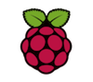
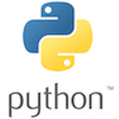
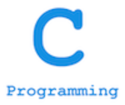

#Jumanji

##Аппаратно – программный комплекс для автоматизации настольной игры  

Данный проект реализуется в рамках курсового проектирования дисциплина СиФО ЭВМ (Структурная и функциональная организация ЭВМ) на специальности ВМСиС (Вычислительные машины системы и сети) БГУИР студентами 3 курса: 

Бордак Анастасией - гр. 650502 
Соколовским Александром – гр. 650502 
Хамутовским Яном – гр. 650501 

Руководитель проекта:  
ассистент каф. ЭВМ Стракович Андрей Иванович 

Проект учавствует в конкурсе курсовых проектов Itransition/future, который проводит компания Itransition

##Используемые технологии:  

 

 

 

##Содержание репозитория:</h4>
1. [Пояснительная записка](documentation/) 
2. [Исходный код проекта](source_code/) 
	2.1 [Raspberry](source_code/raspberry) 
	2.2 [Arduino](source_code/arduino) 
3. [Отчет G-drive](https://bit.ly/2H34X6I) 
 

